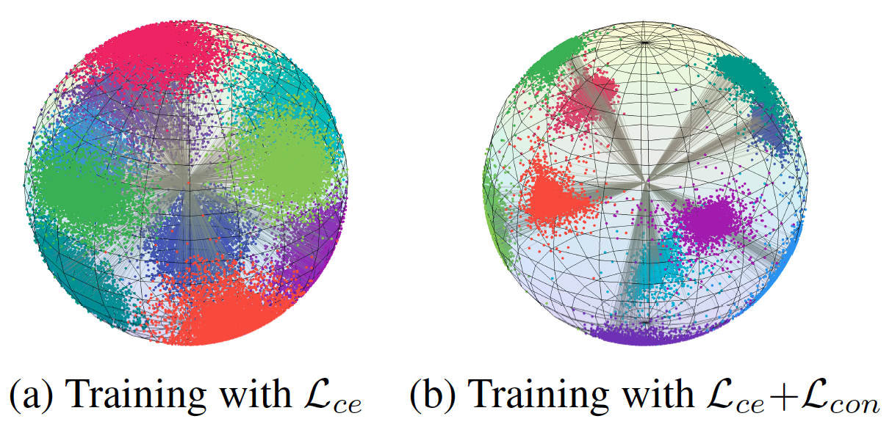

# Core-tuning
This repository is the official implementation of ``Unleashing the Power of Contrastive Self-Supervised Visual Models via Contrast-Regularized Fine-Tuning" (NeurIPS 2021).

The key contributions of this paper are threefold:
*  To the best of our knowledge, we are among the first to look into the fine-tuning stage of CSL models, which is  an important yet under-explored question. To address this, we propose a novel Core-tuning method.
*  We theoretically analyze the benefits of the supervised contrastive loss on representation learning and model optimization, revealing that it is beneficial to model fine-tuning. 
*  Promising results on image classification and semantic segmentation verify the effectiveness of Core-tuning for improving the fine-tuning performance of CSL models. We also empirically find that Core-tuning benefits CSL models in terms of  domain generalization and adversarial robustness on downstream tasks.
Considering the theoretical guarantee and empirical effectiveness of Core-tuning, we recommend using it as a standard baseline to fine-tune CSL models.

The implementation is as follows.

## 1. Requirements
* To install requirements: 
```
pip install -r requirements.txt
```
## 2. Pretrained models
* We provide two checkpoints via Google Drive. Please download the two checkpoints from [here](http://dwz.win/aduH).
* One checkpoint is the pre-trained ResNet-50(1x) model, pre-trained by [MoCo-v2](https://github.com/facebookresearch/moco). We name it pretrain_moco_v2.pkl, which is a necessity for training.
* Another one is the ResNet-50 model fine-tuned by our proposed method, named Core-tuning-model.tar. From this checkpoint, users can directly evaluate the end results without having to train afresh.
* Unzip the download zip file and move the checkpoint files to /code/checkpoint/.

## 3. Datasets
* The dataset of CIFAR-10 can be downloaded by directly running our code.


## 4. Training
* To train the model(s) in the paper, run this command:
```
python Core-tuning.py -a resnet50-ssl --gpu 0 -d cifar10 --eta_weight 0.1 --mixup_alpha 1  --checkpoint checkpoint/ssl-core-tuning/Core_eta0.1_alpha1 --train-batch 64 --accumulate_step 4 --test-batch 100  
```
* Note that the GPU memory should be 24G. Otherwise, you need to halve the train batch size and double the accumulation step. Based on the accumulation, the total training batch is 256.


## 5. Evaluation
* To evaluate my model on ImageNet, run:
```
python Core-tuning.py -a resnet50-ssl --gpu 0 -d cifar10 --test-batch 100 --evaluate --checkpoint checkpoint/Core-tuning-model/ --resume checkpoint/Core-tuning-model/Core-tuning-model.tar
``` 
* The path above refers to our provided checkpoint. You can validate your model by changing the file path of "--checkpoint" and "--resume".
  

## 6. Results
* Our model achieves the following performance on CIFAR-10:

|       Methods       |  Top 1 Accuracy  |  
| :-----------------: | :--------------: | 
|      CE-tuning      |   94.70+/-0.39   | 
|  Core-tuning (ours) |   97.31+/-0.10   | 
  
* Visualizaiton of the learned features on the CIFAR10 validation set:

<p align="left">

</p>  
  
## 7. Citaiton 
If you find our work inspiring or use our codebase in your research, please cite our work.
```
@inproceedings{zhang2021unleashing,
  title={Unleashing the Power of Contrastive Self-Supervised Visual Models via Contrast-Regularized Fine-Tuning},
  author={Zhang, Yifan and Hooi, Bryan and Hu, Dapeng and Liang, Jian and Feng, Jiashi},
  booktitle={Advances in Neural Information Processing Systems}, 
  year={2021}
}
``` 

## 8. Acknowledgements
This project is developed based on [MoCo](https://github.com/facebookresearch/moco) and [SupContrast](https://github.com/HobbitLong/SupContrast). 
